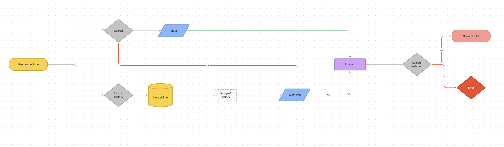
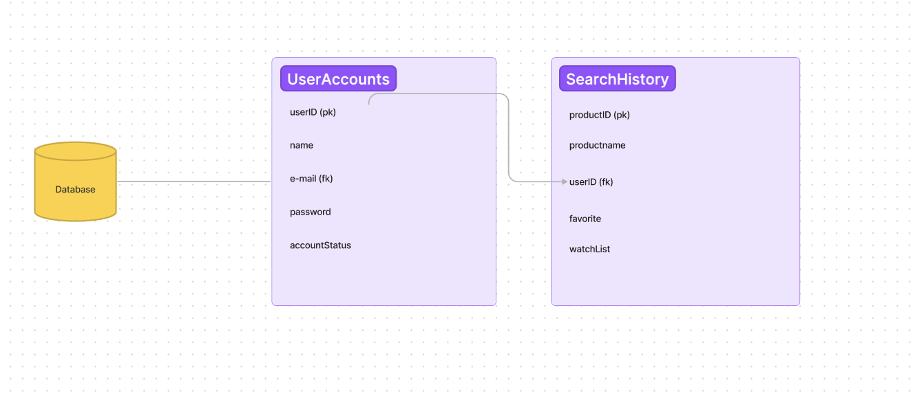

# Shoppers

# Table-of-Contents
  * [Deployed URL](#deployed-url)
  * [Workflow](#workflow)
      * [UI Design](#ui-design)
      * [Database Design](#database-design)
  * [Git Repo](#git-repo)
  * [Dependency](#dependency)
  * [UserStory](#userstory)
  * [Acceptance Criteria](#acceptance-criteria)
  * [Application Invoked](#application-invoked)
  * [Screenshots](#screenshots)


 
## [Deployed URL](#table-of-contents)
```
ENTER HERE
```
To Open POC
1. CD to the shoppers project
2. run
```
  open -a 'google chrome' POS.html
```
## [Workflow](#table-of-contents)
1. Log in

2. Search


### [UI Design](#table-of-contents)

TBD

### [Database Design](#table-of-contents)


## [Git Repo](#table-of-contents)
```
https://github.com/kabirfaisal1/shoppers.git
```

## [Dependency](#table-of-contents)
```
    1. node.js (npm install -g npm) on your system
    2. npm i mysql
    3. npm i express
    4. npm i path
    5. npm i dotenv
    6. npm i sequelize

    opt.
    - npm i nodemon (help you test live without killing server. CLI: nodemon server.js)
```
## [User Story](#table-of-contents)
```
ENTER HERE
```

## [Acceptance Criteria](#table-of-contents)
```
ENTER HERE
```

## [Application Invoked](#table-of-contents)
```
ENTER HERE
```

## [Screenshots](#table-of-contents)
