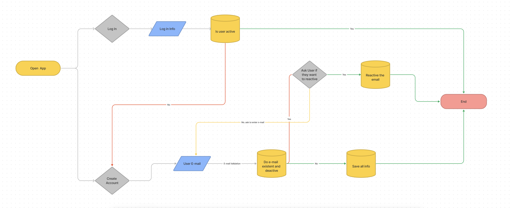

# Shoppers

# Table-of-Contents
  * [Deployed URL](#deployed-url)
  * [Workflow](#workflow)
      * [UI Design](#ui-design)
      * [Database Design](#database-design)
  * [Git Repo](#git-repo)
  * [Dependency](#dependency)
  * [UserStory](#userstory)
  * [Acceptance Criteria](#acceptance-criteria)
  * [Application Invoked](#application-invoked)
  * [Test case](#test-case)
  * [Screenshots](#screenshots)


 
## [Deployed URL](#table-of-contents)
```
ENTER HERE
```
To Open POC
1. CD to the shoppers project
2. run
```
  open -a 'google chrome' POS.html
```
## [Workflow](#table-of-contents)
1. Log in

2. Search


### [UI Design](#table-of-contents)

TBD

### [Database Design](#table-of-contents)


## [Git Repo](#table-of-contents)
```
https://github.com/kabirfaisal1/shoppers.git
```

## [Dependency](#table-of-contents)
```
    1. node.js (npm install -g npm) on your system
    2. npm i mysql
    3. npm i express
    4. npm i path
    5. npm i dotenv
    6. npm i sequelize
    7. npm install cypress --save-dev (in app_Test folder) 

    opt.
    - npm i nodemon (help you test live without killing server. CLI: nodemon server.js)
```
## [User Story](#table-of-contents)
```
ENTER HERE
```

## [Acceptance Criteria](#table-of-contents)
```
ENTER HERE
```

## [Application Invoked](#table-of-contents)
```
ENTER HERE
```
## [Test case](#table-of-contents)
1. start the server from the root
```
  npm start server
```
2. open second terminal go to app_test folder
```
  cd /your/project/path (to app_Test)
```
3. install npm
```
  npm install
```
4. install cypress
```
  npm install cypress --save-dev
```
5. Open cypress
```
  npx cypress open
```
6. From cypress dashboard
* Select e2e
* Select chrome
  *  Click on start E2E testing in chrome (you will see new chrome open next to cy app)
7. Select the test case you want to run
8. OR run cypress headless
```
 npx cypress run
```
## [Screenshots](#table-of-contents)
